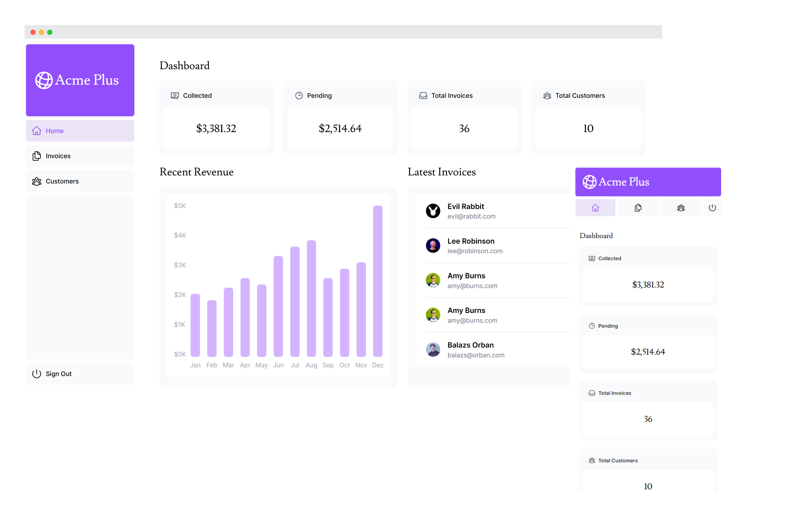

## Next.js Dashboard

This project is a complete and modified version of [Next.js app router template](https://nextjs.org/learn), hosted on Vercel.

🚀 [View demo | 在线预览](https://nextjs-dashboard-cyan-eta-79.vercel.app)

### Tech Stack

- `Next.js 14` app router
- `Tailwind` for styling
- `NextAuth` for login authentication
- `vercel/postgres` for data storing

### Get Started

- `npm i` install all dependencies
- `npm run dev` develop on local server

### Project Structure

- To learn more about the project structure and steps to configure Postgres on Vercel, please refer to [Next.js App Router Guide](https://nextjs.org/learn).
